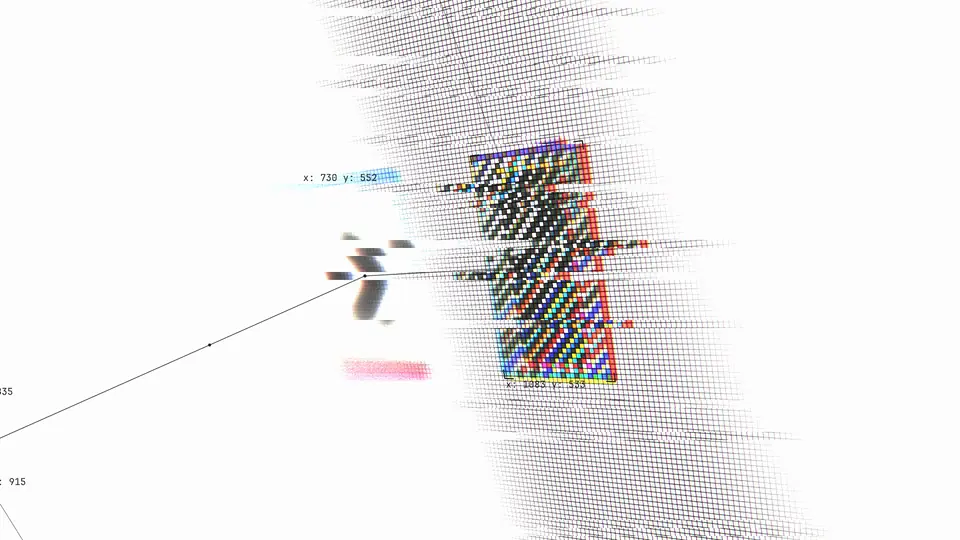
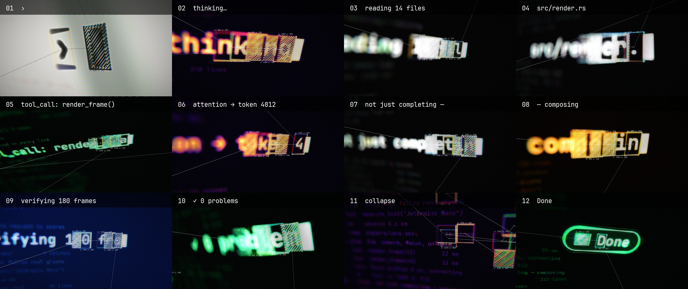
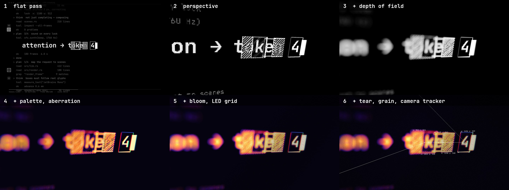

<div align="center">

# ff-tracking

**A virtual camera films an AI agent's screen while a tracker locks onto every glyph it types.**

Six seconds, two [fframes](https://github.com/dmtrKovalenko/fframes) passes, one SkSL shader.
No footage, no stock audio: every pixel and every sound comes from code.

[](https://github.com/dmtrKovalenko/fframes)
[](https://www.rust-lang.org)
[](https://skia.org)
[](LICENSE)

<a href="https://github.com/mrsarac/ff-tracking/releases/download/v1.0.0/tracking.mp4">
  
</a>

**[▶ Full 1080p with sound](https://github.com/mrsarac/ff-tracking/releases/download/v1.0.0/tracking.mp4)** ·
[On X](https://x.com/0xsarac/status/2108515856544317489) ·
[How it works](#how-it-works) ·
[Quick start](#quick-start)

<sub>fframes studies · <b>#1 ff-tracking</b> · <a href="https://github.com/mrsarac/ff-unmute">#2 ff-unmute</a>, the one you can unmute</sub>

</div>

---

## What you are looking at

An agent thinks out loud in a terminal: `thinking…` → `reading 14 files` →
`tool_call: render_frame()` → … → `✓ 0 problems` → `Done`. A computer-vision style tracker
follows the newest characters. A camera that never sits still films the screen up close.

- **Real coordinates.** Every `x: 1403 y: 559` label is the box's actual pixel position in
  that frame of the output. None of them are random numbers.
- **Focus that follows the tracker.** The focal plane is set by the box being tracked, so
  the depth of field racks along the line as the agent types.
- **Chain of thought, drawn.** Links run from box to box in reading order, and a dot runs
  along every link.
- **The lock.** Every shot ends with the newest word locking on: red for two frames, a
  scanline tear, a beep panned to where the box is.
- **Twelve shots, twelve looks.** A cut every 0.5 s through paper white, thermal, black
  and white, phosphor, amber, navy and neon.
- **A collapse and a landing.** Fourteen boxes fall into one, and that box becomes a
  `Done` pill before the fade to black.



## How it works

```text
hud ──► flat    pass 1: SVG, 3840×2160 ─────────► out/pass/flat.mp4 ──┐ iChannel0
 │                                                                      ▼
 ├────► lens    pass 2: SkSL on Skia Metal + camera tracker ──► out/tracking.mp4
 │                                                                      ▲ audio
 └────► tracks ──► out/tracks.json ──► sfx.py ──► out/pass/sfx.wav ─────┘
```

**Pass 1, `flat`**, draws the screen the way a terminal would: black, white, monospace, one
`<text>` per glyph, so the position of every character is known exactly. The tracker boxes
are on the screen itself. Some are hatched with an SVG pattern in `mix-blend-mode:
difference`, so the stripes turn dark where they cross a glyph. The only color is pure red,
and it marks a locked box. The pass renders at 2× because the lens magnifies it up to 3×.

**Pass 2, `lens`**, binds each frame of pass 1 as a shader input and films it. One SkSL
shader does everything physical:



1. **Perspective.** Every pixel shoots a ray at a tilted plane: real perspective, not an SVG skew.
2. **Depth of field.** The circle of confusion comes from the depth difference to the tracked
   target, with 36 golden-angle taps and highlights weighted like bokeh.
3. **Palette and aberration.** Brightness maps through five color stops per shot. R, G and B
   sample at radially shifted points, and the shift grows on a lock.
4. **Bloom and LED grid.** A wide ring of taps lifts everything around bright glyphs. The
   grid uses equal-area RGB stripes, so it adds no tint, and it fades out of focus.
5. **Tear, grain, camera tracker.** Rows slide on a lock and right after a cut. On top, the
   lens draws its own tracker sharp: links, labels and target brackets, projected with
   `hud::project`, the CPU copy of the shader's camera.

Both passes and the sound read the same `hud` crate, so the lens always knows where the
glyph it focuses on actually is.

**Sound**: `tools/sfx.py` reads `out/tracks.json` and synthesizes everything. It makes a
screen hum, a bit-crushed glitch on each cut, a click per keystroke and a pentatonic beep
per lock, panned to the box. It adds a riser into the collapse and a chime with a sub hit on
`Done`. Loudness is measured with ffmpeg's `ebur128` and set to -14 LUFS.

## Quick start

Requirements: macOS with Apple silicon (Skia on Metal), Rust, ffmpeg, Python 3 with `numpy`
and `scipy`. The README images also need Pillow and `img2webp`.

```bash
git clone https://github.com/mrsarac/ff-tracking && cd ff-tracking
tools/render.sh            # → out/tracking.mp4
```

`render.sh` builds the workspace, exports the tracks, renders pass 1, synthesizes the sound
and renders pass 2. It takes about 40 s on an M3 Pro, plus the first build.

Every pass is an fframes CLI, so the usual tools work on each of them:

```bash
target/release/lens strip all -n 12        # contact sheet of the final video
target/release/lens frame 81 -o frames     # one full-size frame
target/release/lens preview                # real-time window with sound
target/release/lens audio analyze          # loudness, true peak
LENS_STAGE=1 target/release/lens frame 81  # stop the shader after a step (0-3), as in the image above
python3 -I tools/readme_media.py           # rebuild the images in this README
```

## Make it yours

Every shot is one entry in `SCENE_LIST` in [`hud/src/lib.rs`](hud/src/lib.rs):

```rust
SceneDef {
    kind: Kind::Typing,
    text: "thinking…",                     // what the agent types
    palette: Palette::Thermal,             // Paper, Thermal, Mono, Phosphor, Amber, Navy, Neon
    //         tilt_x tilt_y  roll  zoom 0→1  pan x, y  blur
    cam: cam(0.38, -0.22, 0.04, 2.5, 2.8, 50.0, 0.0, 1.2),
    hero: (560.0, 540.0),                  // where the line starts on the flat screen
    size: 104.0,                           // font size
},
```

Change the text, a palette or the camera, run `tools/render.sh`, and the tracker, focus,
labels and beeps all follow. `cargo test -p hud` checks that every line fits the screen and
that the camera keeps every target in frame.

## Layout

```text
hud/           shots, tracker boxes, camera per frame, projection (no fframes dependency)
flat/          pass 1: the screen, 3840×2160
lens/          pass 2: lens/shaders/lens.sksl and the camera-space tracker
tools/         render.sh (whole pipeline), sfx.py (sound), readme_media.py (these images)
docs/          design spec, prompts and decisions, fframes contributions
```

## Notes from the build

- A synced video frame is a regular image for a shader:
  `.image("iChannel0", &frame.get_synced_video_frame(..)?.into_image())`. That is what makes
  the two-pass camera possible.
- `flat` is a reserved word in SkSL (a GLSL ES interpolation qualifier), so name helpers
  something else.
- At the `Video` level, never return `Svgr::empty()`; return a root `<svg>`. An empty root is
  an error, and late in a Skia render it surfaces only after the encoders drain
  ([fframes#209](https://github.com/dmtrKovalenko/fframes/issues/209)).
- The two passes exist because a shader can't yet sample an SVG subtree of the same frame.
  [fframes#210](https://github.com/dmtrKovalenko/fframes/issues/210) proposes that.

## Credits

- Visual style inspired by [Michael Nowak (@mnowakdesign)](https://x.com/mnowakdesign/status/2108253918086176899).
  None of his footage is used.
- Built on [fframes](https://github.com/dmtrKovalenko/fframes) by Dmitriy Kovalenko, rendering with
  [Skia](https://skia.org), encoding with [FFmpeg](https://ffmpeg.org).
- Font: [JetBrains Mono](https://github.com/JetBrains/JetBrainsMono) (SIL OFL 1.1, see
  [`licenses/JetBrainsMono-OFL.txt`](licenses/JetBrainsMono-OFL.txt)).
- Made with Claude Code. [`docs/PROMPT.md`](docs/PROMPT.md) is the prompt that makes this video,
  and the design is in [`docs/superpowers/specs/`](docs/superpowers/specs/2026-10-09-tracking-hud-design.md).

## License

[MIT](LICENSE) © 2026 Mustafa Saraç. The font keeps its own license.
